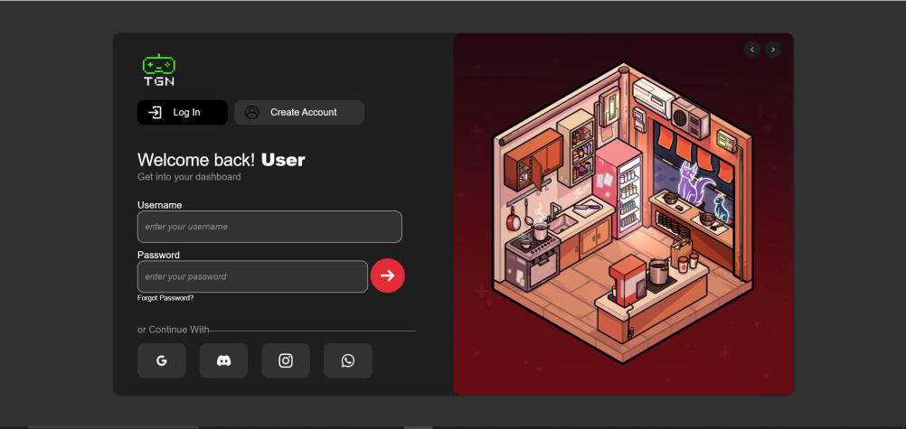
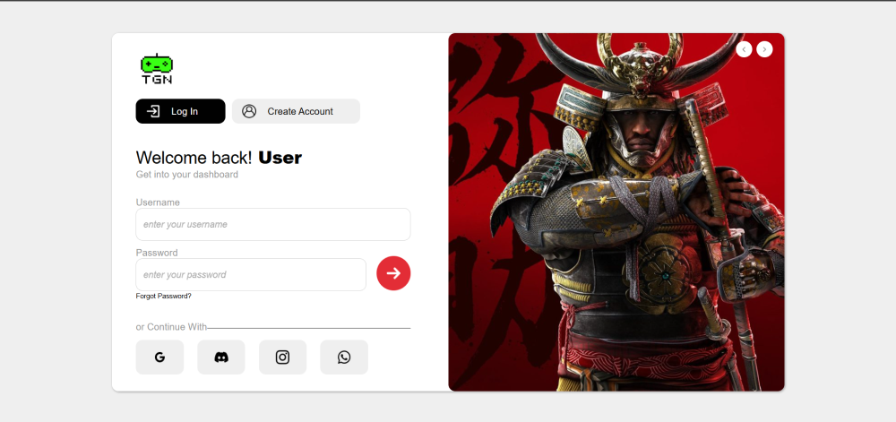
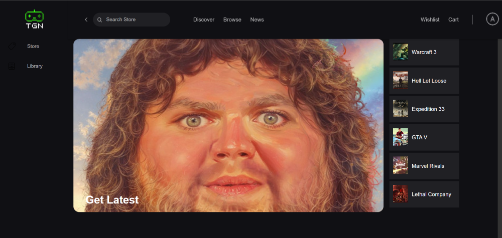

# The Gamers Nexus 🎮

**The Gamers Nexus** is a **digital video game store** inspired by Epic Games, built with **React (Vite)** for the frontend and **MSSQL** for the backend. It offers a modern UI with **dark and light modes**, designed for gamers who want a smooth and interactive experience.  

> ⚠️ Currently, the backend is closed, so on GitHub Pages you can only explore the **authentication page**.

---

## Features

- **User Authentication:** Session-based auth using **Redis**  
- **Game Browsing & Search:** Find games quickly with the search functionality  
- **Social Features:** Comment on games, add friends, and see recommended games  
- **Purchasing System:** Buy games directly through the platform  
- **Dark & Light Mode:** Switch between themes for a personalized experience  

---

## Tech Stack

- **Frontend:** React + Vite  
- **Backend:** MSSQL  
- **Authentication:** Redis session-based  
- **Future Plans:** Moving backend to **Supabase** and deployment on **Vercel**  

---

## Future Improvements

- Full **backend integration** for GitHub Pages viewing  
- **Responsive design** for mobile and tablet devices  
- Improved **animations**, **commenting system**, and **page interactions**  
- Complete **store functionality** with live purchasing  

---

## Screenshots

## Screenshots

---

## Usage

Since the backend is closed, you can currently explore only the **authentication page** on GitHub Pages.  

**Planned:** Once deployed with Supabase, the full app will be accessible online with all features working.

---

## License

This project is open for learning and demonstration purposes.  

---

## Contact

Developed by [MObaidullahFsl] along with [DemolisherCpp]. 
